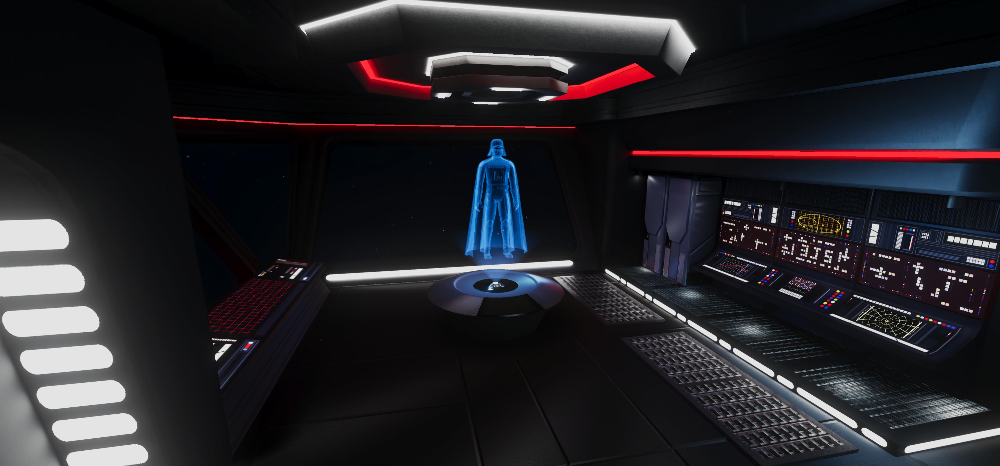

# Imperial Transmission · A Three.js Experience

A 3D hologram scene inspired by Star Wars, built with Three.js and GLSL shaders. Features animated screen patterns, character switching, and dust effects. Starship model crafted in Blender with baking, optimized to 3,293 triangles.



---

## Live Demo

[View on Vercel](https://threejs-imperial-transmission.vercel.app/)

---

## Controls

- **Click hologram**: Cycle models.
- **Press "F" or double-click**: Toggle fullscreen.

---

## Setup

1. Clone repo:

   ```bash
   git clone https://github.com/chrismaldona2/threejs-imperial-transmission.git
   ```

2. Install dependencies:

   ```bash
   npm install
   ```

3. Run dev server:

   ```bash
   npm run start
   ```

4. Open http://localhost:5173 in your browser.

Requires [Node.js](https://nodejs.org/)
